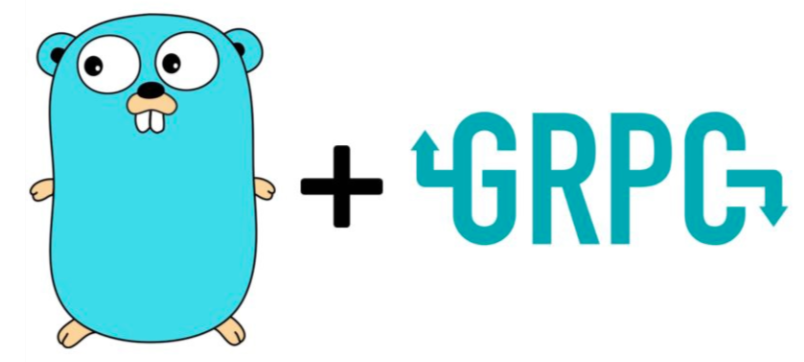

# go-gRPC-examples

</img>

This repo contains examples and implementations of different types of GRPC services and APIs using [Golang](https://golang.org/).

## What is gRPC

[gRPC](https://grpc.io/docs/) ( gRPC Remote Procedure Calls ) is an open source remote procedure call ( RPC ) system initially developed at Google in 2015.

It uses [HTTP/2](https://en.wikipedia.org/wiki/HTTP/2) for transport, Protocol Buffers as the interface description language, and provides features such as authentication, bidirectional streaming and flow control, blocking or nonblocking bindings, and cancellation and timeouts.
It generates cross-platform client and server bindings for many languages. Most common usage scenarios include connecting services in microservices style architecture and connect mobile devices, browser clients to backend services.

## Types of gRPC

* Unary
* Stream
* Bi-directional Stream

## Overview of gRPC

Here i made a little version of gRPC overview, and topology. The first version is portuguese language, but is easy to understand. Follow the link.

* [gRPC-Overview - Portuguese version](https://slides.com/thiagozs/grpc-overview#/grpc-overview)

## Versioning and license

We use SemVer for versioning. You can see the versions available by checking the tags on this repository.

For more details about our license model, please take a look at the [LICENSE](LICENCE) file

2020, thiagozs
